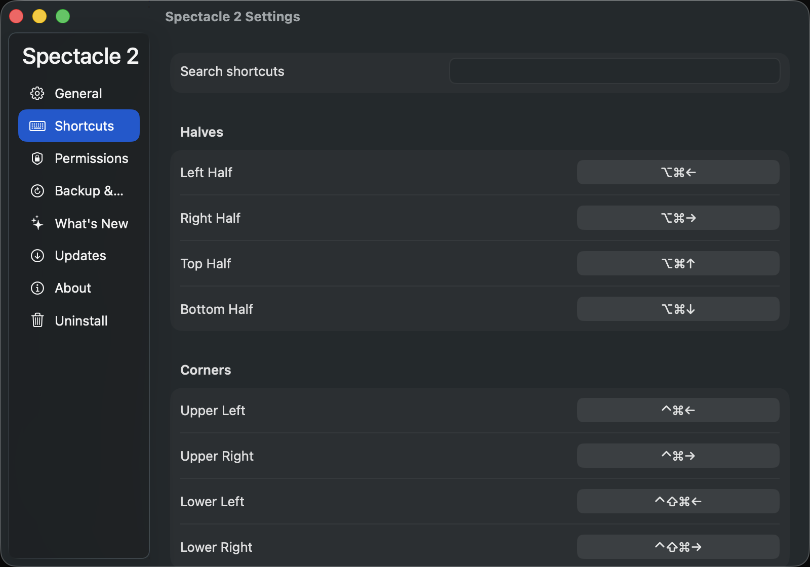
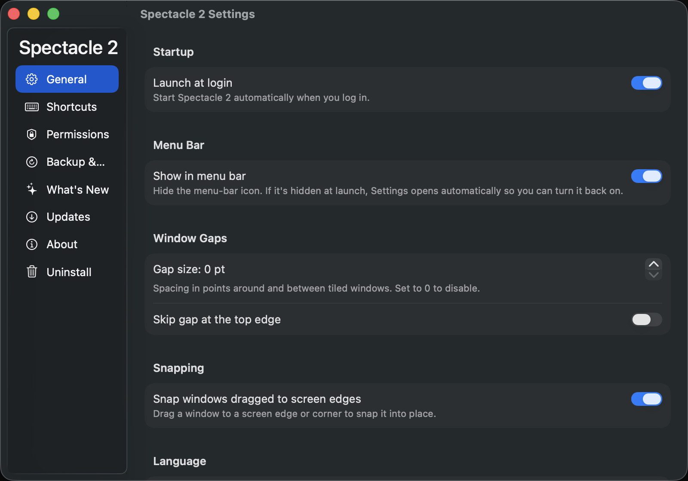

<div align="center">
  
  <h1>Spectacle 2</h1>
  <p><strong>Move and resize windows with keyboard shortcuts</strong></p>
</div>

Spectacle 2 organizes windows without a mouse. Press a shortcut and the frontmost window moves to a half, a corner, a third, another display, or fills the screen — and ⌥⌘Z puts it back. It is a Swift rewrite of Eric Czarny's Spectacle, rebuilt for macOS 26.

## Screenshots





[](https://github.com/teddychan/spectacle-2/releases/latest)


[](https://www.dragonapp.com/spectacle-2/)
[](LICENSE.md)

## Contents

- [Screenshots](#screenshots)
- [Requirements](#requirements)
- [Install](#install)
- [Features](#features)
- [Keyboard shortcuts](#keyboard-shortcuts)
- [Troubleshooting](#troubleshooting)
- [Building from source](#building-from-source)
- [Tests](#tests)
- [Contributing](#contributing)
- [Credits](#credits)
- [License](#license)

## Requirements

- macOS 26 (Tahoe) or later
- Apple Silicon — the released build ships as an `arm64` binary
- Accessibility permission, which macOS asks for on first launch

## Install

### Homebrew

```sh
brew install --cask teddychan/tap/spectacle-2
```

### Manual

1. Download `Spectacle2-vX.Y.Z.zip` from the [latest release](https://github.com/teddychan/spectacle-2/releases/latest).
2. Unzip it and move **Spectacle 2.app** to `/Applications`.
3. Launch it, then grant access under **System Settings ▸ Privacy & Security ▸ Accessibility**.

Spectacle 2 has no Dock icon. It lives in the menu bar, and its Settings window opens from there.

### Uninstall

Quit Spectacle 2 from the menu bar first, then remove it. The Settings window also has an **Uninstall** pane that removes the app, its login item, and its settings for you.

```sh
brew uninstall --cask spectacle-2
```

Or delete the app and its leftovers by hand:

```
~/Library/Preferences/com.dragonapp.spectacle-2.plist
~/Library/Preferences/com.dragonapp.spectacle-2.settings.plist
~/Library/Caches/com.dragonapp.spectacle-2
~/Library/HTTPStorages/com.dragonapp.spectacle-2
~/Library/Saved Application State/com.dragonapp.spectacle-2.savedState
~/Library/Application Support/Spectacle 2
```

## Features

- **18 window actions** — halves, corners, thirds, fullscreen, center, resize, display moves, and undo/redo, each on its own global shortcut
- **Repeat-press cycling** — press a half or corner shortcut again to cycle that window through ½, ⅔, and ⅓ of the region
- **Thirds navigation** — ⌃⌥→ and ⌃⌥← step a window through three vertical columns and three horizontal rows
- **Drag-to-edge snapping** — drag a window to a screen edge or corner to snap it, with a translucent footprint preview of where it will land
- **Configurable window gaps** — set a gap in points applied around and between tiled windows, with an option to skip the top edge
- **Undo and redo** — ⌥⌘Z restores the previous frame and ⌥⇧⌘Z reapplies the action; drag-snaps record into the same history
- **Multiple displays** — ⌃⌥⌘→ and ⌃⌥⌘← send the frontmost window to the next or previous display
- **Editable shortcuts** — record any combination in the Shortcuts pane, search the list, or restore the defaults
- **Menu-bar item** — a monochrome template icon that you can hide from the General pane
- **Launch at login** — register Spectacle 2 as a login item so it starts with your session
- **Software updates** — check from the menu bar or the Updates pane, or turn on automatic checks; releases arrive over a signed Sparkle feed
- **Seven languages** — English, Spanish, French, Japanese, Korean, Simplified Chinese, and Traditional Chinese, switchable in Settings without a restart

> [!NOTE]
> Spectacle 2 is an independent open-source fork of [Spectacle](https://github.com/eczarny/spectacle) by Eric Czarny, rebuilt in Swift and maintained by [Teddy Chan](https://github.com/teddychan).

## Keyboard shortcuts

Every shortcut triggers a _window action_ — a command that tells Spectacle 2 how to change the size or position of the frontmost window. A shortcut is one or more modifier keys paired with a character key:

| Symbol | Key         |
|:------:|:-----------:|
|   ⌘    | Command Key |
|   ⌃    | Control Key |
|   ⌥    | Option Key  |
|   ⇧    | Shift Key   |

These are the defaults. Change any of them in the Shortcuts pane, or clear one to disable that action entirely.

| Action | Shortcut |
|---|---|
| Center | ⌥⌘C |
| Fullscreen | ⌥⌘F |
| Left half / right half | ⌥⌘← / ⌥⌘→ |
| Top half / bottom half | ⌥⌘↑ / ⌥⌘↓ |
| Upper left / upper right | ⌃⌘← / ⌃⌘→ |
| Lower left / lower right | ⌃⇧⌘← / ⌃⇧⌘→ |
| Previous third / next third | ⌃⌥← / ⌃⌥→ |
| Previous display / next display | ⌃⌥⌘← / ⌃⌥⌘→ |
| Make smaller / make larger | ⌃⌥⇧← / ⌃⌥⇧→ |
| Undo / redo | ⌥⌘Z / ⌥⇧⌘Z |

### Basic window actions

Centering a window does **not** change its size; every other region action does.

Press a region shortcut repeatedly to cycle it. Activate _left half_ ⌥⌘← more than once and the window moves between ⅓, ⅔, and back to ½ of the left side of the screen. The same applies to the right, top, and bottom halves and to all four corners.

_Previous third_ and _next third_ walk a window around the screen's six thirds — the three vertical columns first, then the three horizontal rows.

Resizing works the same way: ⌃⌥⇧→ makes a window larger and ⌃⌥⇧← makes it smaller. Spectacle 2 always tries to keep the edges of a window in contact with the edges of the screen while resizing.

### Multiple displays

⌃⌥⌘→ moves a window to the next available display, ⌃⌥⌘← to the previous one. A window that already fits is centered on the new display; one that does not is resized to fill it.

### Window action history

Spectacle 2 remembers where a window was before each action. ⌥⌘Z undoes the last action and ⌥⇧⌘Z redoes it. Windows snapped by dragging are recorded in the same history, so undo works for those too.

## Troubleshooting

### Spectacle 2 is requesting access to use accessibility features

macOS's accessibility APIs are what make Spectacle 2 possible: they let an assistive app drive another application's user interface. Spectacle 2 cannot move a single window without that access, so grant it under **System Settings ▸ Privacy & Security ▸ Accessibility**.

While the permission is missing, the menu-bar menu shows a warning item that opens the Permissions pane. Once you grant access, Spectacle 2 arms itself the next time it becomes active or the next time you open the menu — no restart needed.

### Spectacle 2 does not resize a particular window as expected

macOS lets applications place constraints on the size of their windows, so developers can design interfaces without supporting every possible dimension. Where those constraints apply, Spectacle 2 cannot resize a window to the exact dimensions a shortcut asks for.

Suppose a display is 2880x1800 and a window is being moved to the left half. If that window declares a minimum width of 1600 points, it cannot be narrowed to the expected 1440. Window constraints are always respected, even when the result is not what the shortcut implies — here the window ends up 1600 points wide.

### Spectacle 2 behaves strangely with Terminal windows

Terminal (and emulators like iTerm2) constrain resizing so that whole rows and columns stay visible. That guarantees nothing is truncated, but it means Spectacle 2 has to work harder to fit those windows.

Spectacle 2 first tries the desired dimensions; if the window will not fit, it tries again slightly smaller, repeating until the window fits with its constraints intact. The result is a window centered within the target region, at the cost of a slightly jittery resize.

### Spectacle 2 does not work with all applications

Most applications built with the Cocoa frameworks can be manipulated through the accessibility APIs, which covers nearly every window you will meet. Applications that build their interfaces in unusual ways are the exception, and Spectacle 2 cannot move or resize their windows.

## Building from source

Spectacle 2 is a Swift package — no Xcode project, no external package manager beyond SwiftPM.

```sh
git clone https://github.com/teddychan/spectacle-2.git
cd spectacle-2
swift build
```

To run it locally, use the helper script:

```sh
./scripts/run.sh
```

It builds a debug binary, assembles a `.app` around it, re-identifies it as **Spectacle 2 Debug** (`com.dragonapp.spectacle-2.debug`) so its Accessibility grant and settings never collide with an installed release copy, signs it, and launches it.

## Tests

The suite lives in `Tests/SpectacleCoreTests` and exercises the pure geometry in `SpectacleCore`: halves, corners, thirds, center and fullscreen, repeat-press cycling, window gaps, drag-snap zones, size adjustment, screen cycling across displays, undo/redo history, and the default shortcut table. CI runs the whole suite on every pull request.

[](https://github.com/teddychan/spectacle-2/actions/workflows/tests.yml)

```bash
swift test
```

| Metric | Value |
|---|---|
| Test cases | 74 passing |
| Line coverage | 98.8% of `Sources/SpectacleCore` |
| Measured on | v2.1.0 (`d434930`), Swift 6.3.3 |

Coverage is measured over `SpectacleCore` only. The `Spectacle2` app target — the
menu-bar item, settings panes, hot-key registration, and the snap overlay — has no
automated tests, so that figure describes the geometry engine rather than the whole app.

## Contributing

Issues and pull requests are welcome. See [CONTRIBUTING.md](CONTRIBUTING.md).

## Credits

Spectacle was created by [Eric Czarny](https://github.com/eczarny) and shaped by its [original contributors](https://github.com/eczarny/spectacle/graphs/contributors) over almost a decade. The window-position math in Spectacle 2 is a port of theirs, and the shortcuts are the ones they chose.

Spectacle 2 is maintained by [Teddy Chan](https://github.com/teddychan).

## License

Spectacle 2 is distributed under the MIT License. See [LICENSE.md](LICENSE.md), which retains the original copyright (c) 2017 Eric Czarny.
